# 📊 Database Entity Relationship Diagram - PlantUML Format

## Interactive ER Diagram (PlantUML Syntax)

```plantuml
@startuml MendaurDatabase
!theme plain
skinparam linetype ortho
skinparam backgroundColor #FEFEFE
skinparam classBackgroundColor #F5F5F5
skinparam classBorderColor #333333

' Core Entities
entity "USERS" as users {
  + no_hp [PK, VARCHAR(255)]
  --
  nama [VARCHAR(255)]
  email [VARCHAR(255), UNIQUE]
  password [VARCHAR(255)]
  alamat [TEXT]
  foto_profil [VARCHAR(255)]
  total_poin [INT, default:0]
  total_setor_sampah [INT, default:0]
  level [VARCHAR(255)]
  created_at [TIMESTAMP]
  updated_at [TIMESTAMP]
}

' Waste Management
entity "KATEGORI_SAMPAH" as kategori_sampah {
  + id [PK, BIGINT]
  --
  nama [VARCHAR(255)]
  deskripsi [TEXT]
  icon [VARCHAR(255)]
  created_at [TIMESTAMP]
}

entity "JENIS_SAMPAH" as jenis_sampah {
  + id [PK, BIGINT]
  kategori_id [FK, BIGINT]
  --
  nama [VARCHAR(255)]
  deskripsi [TEXT]
  created_at [TIMESTAMP]
}

entity "JADWAL_PENYETORAN" as jadwal_penyetoran {
  + id [PK, BIGINT]
  --
  tanggal [DATE]
  waktu_mulai [TIME]
  waktu_selesai [TIME]
  lokasi [VARCHAR(255)]
  kapasitas [INT]
  status [ENUM]
  created_at [TIMESTAMP]
}

entity "TABUNG_SAMPAH" as tabung_sampah {
  + id [PK, BIGINT]
  user_id [FK, VARCHAR(255)]
  jadwal_id [FK, BIGINT]
  --
  nama_lengkap [VARCHAR(255)]
  no_hp [VARCHAR(255)]
  titik_lokasi [TEXT]
  jenis_sampah [VARCHAR(255)]
  berat_kg [DECIMAL(8,2)]
  foto_sampah [TEXT]
  status [ENUM]
  poin_didapat [INT]
  created_at [TIMESTAMP]
}

' Products & Redemption
entity "PRODUKS" as produks {
  + id [PK, BIGINT]
  --
  nama [VARCHAR(255)]
  deskripsi [TEXT]
  harga [DECIMAL(15,2)]
  poin_diperlukan [INT]
  stok [INT]
  kategori [VARCHAR(255)]
  foto [VARCHAR(255)]
  status [ENUM]
  created_at [TIMESTAMP]
}

entity "PENUKARAN_PRODUK" as penukaran_produk {
  + id [PK, BIGINT]
  user_id [FK, VARCHAR(255)]
  produk_id [FK, BIGINT]
  --
  nama_produk [VARCHAR(255)]
  poin_digunakan [INT]
  jumlah [INT]
  status [ENUM]
  metode_ambil [TEXT]
  catatan [TEXT]
  tanggal_penukaran [TIMESTAMP]
  tanggal_diambil [TIMESTAMP]
  created_at [TIMESTAMP]
}

' Transactions
entity "KATEGORI_TRANSAKSI" as kategori_transaksi {
  + id [PK, BIGINT]
  --
  nama [VARCHAR(255)]
  kode [VARCHAR(50)]
  deskripsi [TEXT]
  tipe [ENUM]
  created_at [TIMESTAMP]
}

entity "TRANSAKSIS" as transaksis {
  + id [PK, BIGINT]
  user_id [FK, VARCHAR(255)]
  produk_id [FK, BIGINT]
  kategori_id [FK, BIGINT]
  --
  jumlah [INT]
  total_poin [INT]
  status [ENUM]
  metode_pengiriman [VARCHAR(255)]
  alamat_pengiriman [TEXT]
  created_at [TIMESTAMP]
}

entity "PENARIKAN_TUNAI" as penarikan_tunai {
  + id [PK, BIGINT]
  user_id [FK, VARCHAR(255)]
  processed_by [FK, VARCHAR(255)]
  --
  jumlah_poin [INT]
  jumlah_rupiah [DECIMAL(15,2)]
  nomor_rekening [VARCHAR(50)]
  nama_bank [VARCHAR(100)]
  nama_penerima [VARCHAR(255)]
  status [ENUM]
  catatan_admin [TEXT]
  processed_at [TIMESTAMP]
  created_at [TIMESTAMP]
}

' Points System
entity "POIN_TRANSAKSIS" as poin_transaksis {
  + id [PK, BIGINT]
  user_id [FK, VARCHAR(255)]
  tabung_sampah_id [FK, BIGINT]
  --
  jenis_sampah [VARCHAR(255)]
  berat_kg [DECIMAL(6,2)]
  poin_didapat [INT]
  sumber [VARCHAR(255)]
  keterangan [TEXT]
  referensi_id [BIGINT]
  referensi_tipe [VARCHAR(255)]
  created_at [TIMESTAMP]
}

' Gamification
entity "BADGES" as badges {
  + id [PK, BIGINT]
  --
  nama [VARCHAR(255)]
  deskripsi [TEXT]
  icon [VARCHAR(255)]
  syarat_poin [INT]
  syarat_setor [INT]
  reward_poin [INT]
  tipe [ENUM]
  created_at [TIMESTAMP]
}

entity "USER_BADGES" as user_badges {
  + id [PK, BIGINT]
  user_id [FK, VARCHAR(255)]
  badge_id [FK, BIGINT]
  --
  tanggal_dapat [TIMESTAMP]
  reward_claimed [BOOLEAN]
  created_at [TIMESTAMP]
}

entity "BADGE_PROGRESS" as badge_progress {
  + id [PK, BIGINT]
  user_id [FK, VARCHAR(255)]
  badge_id [FK, BIGINT]
  --
  current_value [INT]
  target_value [INT]
  progress_percentage [DECIMAL(5,2)]
  is_unlocked [BOOLEAN]
  unlocked_at [TIMESTAMP]
  created_at [TIMESTAMP]
}

' Notifications & Logging
entity "NOTIFIKASI" as notifikasi {
  + id [PK, BIGINT]
  user_id [FK, VARCHAR(255)]
  --
  judul [VARCHAR(255)]
  pesan [TEXT]
  tipe [VARCHAR(255)]
  is_read [BOOLEAN]
  related_id [BIGINT]
  related_type [VARCHAR(255)]
  created_at [TIMESTAMP]
}

entity "LOG_AKTIVITAS" as log_aktivitas {
  + id [PK, BIGINT]
  user_id [FK, VARCHAR(255)]
  --
  tipe_aktivitas [VARCHAR(50)]
  deskripsi [TEXT]
  poin_perubahan [INT]
  tanggal [TIMESTAMP]
  created_at [TIMESTAMP]
}

' Content
entity "ARTIKELS" as artikels {
  + id [PK, BIGINT]
  --
  judul [VARCHAR(255)]
  konten [LONGTEXT]
  keterangan [TEXT]
  foto [VARCHAR(255)]
  status [ENUM]
  created_at [TIMESTAMP]
}

' Sessions
entity "SESSIONS" as sessions {
  + id [PK, VARCHAR(255)]
  user_id [FK, VARCHAR(255)]
  --
  ip_address [VARCHAR(45)]
  user_agent [TEXT]
  payload [LONGTEXT]
  last_activity [INT]
  created_at [TIMESTAMP]
}

' Relationships - USERS (Central Hub)
users ||--o{ tabung_sampah : deposits
users ||--o{ penukaran_produk : redeems
users ||--o{ transaksis : performs
users ||--o{ penarikan_tunai : requests
users ||--o{ notifikasi : receives
users ||--o{ log_aktivitas : generates
users ||--o{ badge_progress : tracks
users ||--o{ user_badges : earns
users ||--o{ poin_transaksis : "point history"
users ||--o{ sessions : "login sessions"
penarikan_tunai }o--|| users : "processed by"

' Relationships - Waste Management
kategori_sampah ||--o{ jenis_sampah : contains
jenis_sampah ||--o{ tabung_sampah : "stored in"
jadwal_penyetoran ||--o{ tabung_sampah : "follows schedule"
tabung_sampah ||--o{ poin_transaksis : generates

' Relationships - Products & Transactions
produks ||--o{ penukaran_produk : "redeemed for"
produks ||--o{ transaksis : "sold through"
kategori_transaksi ||--o{ transaksis : categorizes
penukaran_produk ||--o{ transaksis : references

' Relationships - Gamification
badges ||--o{ user_badges : "awarded as"
badges ||--o{ badge_progress : "progresses toward"

@enduml
```



---

## 🎯 **Alternative ASCII Relationship Matrix**

```
RELATIONSHIP MATRIX (✓ = 1:M, ✕ = M:M)
═════════════════════════════════════════════════════════════════

                      TAB  PEN  TRN  PRA  NOT  LOG  BAD  PTS  SES
users                  ✓    ✓    ✓    ✓    ✓    ✓    ✕    ✓    ✓
kategori_sampah        →
jenis_sampah           →    
jadwal_penyetoran      →
tabung_sampah                                            ✓
produks                     ✓    ✓
kategori_transaksi                ✓
badges                                        ✓    ✓
user_badges
badge_progress

KEY:
─────
✓  = One-to-Many (1:M) relationship
✕  = Many-to-Many (M:M) relationship (via junction)
→  = Foreign key reference
(blank) = No direct relationship

LEGEND EXAMPLE:
─────────────
users.no_hp → tabung_sampah.user_id (✓)
  = One user can have many waste deposits
  
badges ✕ users (via user_badges)
  = Many users can have many badges
```

---

## 📊 **Table Dependency Graph**

```
DEPENDENCY HIERARCHY (✓ = depends on, ◄ = depended by)

Level 0 (Independent):
  ├─ KATEGORI_SAMPAH (standalone)
  ├─ JADWAL_PENYETORAN (standalone)
  ├─ PRODUKS (standalone)
  ├─ KATEGORI_TRANSAKSI (standalone)
  ├─ BADGES (standalone)
  └─ ARTIKELS (standalone)

Level 1 (Depends on Level 0):
  ├─ JENIS_SAMPAH ✓ kategori_sampah
  └─ USERS (independent)

Level 2 (Depends on Users + Level 1):
  ├─ TABUNG_SAMPAH ✓ users, jenis_sampah, jadwal_penyetoran
  ├─ PENUKARAN_PRODUK ✓ users, produks
  ├─ TRANSAKSIS ✓ users, produks, kategori_transaksi
  ├─ PENARIKAN_TUNAI ✓ users (both user_id and processed_by)
  ├─ NOTIFIKASI ✓ users
  ├─ LOG_AKTIVITAS ✓ users
  ├─ USER_BADGES ✓ users, badges
  ├─ BADGE_PROGRESS ✓ users, badges
  └─ SESSIONS ✓ users

Level 3 (Depends on Level 2):
  └─ POIN_TRANSAKSIS ✓ users, tabung_sampah

System Tables (Infrastructure):
  ├─ PERSONAL_ACCESS_TOKENS (references users)
  ├─ CACHE (independent)
  └─ CACHE_LOCKS (independent)


DELETE CASCADE IMPACT ANALYSIS:
════════════════════════════════

If users.no_hp deleted → Cascades to 10 tables:
  users (1) 
    ├─ tabung_sampah (N) ✓
    │   └─ poin_transaksis (N) ✓
    ├─ penukaran_produk (N) ✓
    ├─ transaksis (N) ✓
    ├─ penarikan_tunai (N) ✓  [user_id cascade]
    ├─ notifikasi (N) ✓
    ├─ log_aktivitas (N) ✓
    ├─ badge_progress (N) ✓
    ├─ user_badges (N) ✓
    └─ sessions (N) ✓

If tabung_sampah deleted → Cascades to 1 table:
  tabung_sampah (1)
    └─ poin_transaksis (N) ✓ [SET NULL possible]

If produks deleted → Cascades to 2 tables:
  produks (1)
    ├─ penukaran_produk (N) ✓
    └─ transaksis (N) ✓

If badges deleted → Cascades to 2 tables:
  badges (1)
    ├─ user_badges (N) ✓
    └─ badge_progress (N) ✓
```

---

## 🔀 **Junction Tables (M:M Relationships)**

```
MANY-TO-MANY RELATIONSHIPS:
═══════════════════════════

Relationship: users ◄──M:M──► badges

Junction Table: USER_BADGES
├─ PK: id
├─ FK1: user_id → users.no_hp (cascade delete)
├─ FK2: badge_id → badges.id (cascade delete)
├─ Unique constraint on (user_id, badge_id)
└─ Additional columns:
   ├─ tanggal_dapat (when earned)
   ├─ reward_claimed (was reward given?)
   └─ timestamps


Example Data Flow:
─────────────────

User "08123456789" (no_hp) earns 3 badges:

badges table:
  id │ nama                │ reward_poin
  ───┼─────────────────────┼────────────
  1  │ "Eco Warrior"       │ 50
  5  │ "Green Champion"    │ 100
  12 │ "Waste Master"      │ 150

user_badges table (many-to-many):
  id │ user_id      │ badge_id │ tanggal_dapat          │ reward_claimed
  ───┼──────────────┼──────────┼────────────────────────┼─────────────────
  1  │ 08123456789  │ 1        │ 2025-10-15 10:00:00   │ true
  2  │ 08123456789  │ 5        │ 2025-11-01 14:30:00   │ true
  3  │ 08123456789  │ 12       │ 2025-11-20 09:00:00   │ true

Result: User has 3 badges + total 300 bonus points from rewards
```

---

## 🔗 **Foreign Key Reference Summary**

```
COMPLETE FOREIGN KEY MAPPING:
═════════════════════════════

TABLE              │ FK COLUMN         │ REFERENCES              │ DELETE RULE
─────────────────┼──────────────────┼─────────────────────────┼─────────────
tabung_sampah     │ user_id          │ users.no_hp             │ CASCADE
tabung_sampah     │ jadwal_id        │ jadwal_penyetoran.id    │ CASCADE
tabung_sampah     │ (jenis_sampah_id)│ jenis_sampah.id         │ Optional
─────────────────┼──────────────────┼─────────────────────────┼─────────────
jenis_sampah      │ kategori_id      │ kategori_sampah.id      │ CASCADE
─────────────────┼──────────────────┼─────────────────────────┼─────────────
penukaran_produk  │ user_id          │ users.no_hp             │ CASCADE
penukaran_produk  │ produk_id        │ produks.id              │ CASCADE
─────────────────┼──────────────────┼─────────────────────────┼─────────────
transaksis        │ user_id          │ users.no_hp             │ CASCADE
transaksis        │ produk_id        │ produks.id              │ CASCADE
transaksis        │ kategori_id      │ kategori_transaksi.id   │ CASCADE
─────────────────┼──────────────────┼─────────────────────────┼─────────────
penarikan_tunai   │ user_id          │ users.no_hp             │ CASCADE
penarikan_tunai   │ processed_by      │ users.no_hp             │ SET NULL
─────────────────┼──────────────────┼─────────────────────────┼─────────────
notifikasi        │ user_id          │ users.no_hp             │ CASCADE
─────────────────┼──────────────────┼─────────────────────────┼─────────────
log_aktivitas     │ user_id          │ users.no_hp             │ CASCADE
─────────────────┼──────────────────┼─────────────────────────┼─────────────
user_badges       │ user_id          │ users.no_hp             │ CASCADE
user_badges       │ badge_id         │ badges.id               │ CASCADE
─────────────────┼──────────────────┼─────────────────────────┼─────────────
badge_progress    │ user_id          │ users.no_hp             │ CASCADE
badge_progress    │ badge_id         │ badges.id               │ CASCADE
─────────────────┼──────────────────┼─────────────────────────┼─────────────
poin_transaksis   │ user_id          │ users.no_hp             │ CASCADE
poin_transaksis   │ tabung_sampah_id │ tabung_sampah.id        │ SET NULL
─────────────────┼──────────────────┼─────────────────────────┼─────────────
sessions          │ user_id          │ users.no_hp             │ CASCADE
─────────────────┼──────────────────┼─────────────────────────┼─────────────

TOTAL FOREIGN KEYS: 25+
CASCADE RULES: 23
SET NULL RULES: 2
```

---

## 📈 **Data Flow Diagrams**

```
WASTE DEPOSIT FLOW:
════════════════════

1. User schedules deposit
   USER ──selects──> JADWAL_PENYETORAN

2. User creates deposit
   USER ──creates──> TABUNG_SAMPAH
   
   TABUNG_SAMPAH references:
   ├─ users.no_hp (who deposited)
   ├─ jadwal_penyetoran.id (when/where)
   └─ jenis_sampah.id (what type)

3. System awards points
   TABUNG_SAMPAH ──generates──> POIN_TRANSAKSIS
   
   POIN_TRANSAKSIS records:
   ├─ user_id (who gets points)
   ├─ tabung_sampah_id (which deposit)
   ├─ poin_didapat (how many points)
   ├─ sumber = 'setor_sampah' (point type)
   └─ created_at (when awarded)

4. Check progress toward badges
   POIN_TRANSAKSIS ──accumulates──> BADGE_PROGRESS
   
   System updates badge progress if:
   ├─ Current total points >= badge requirement
   ├─ Or total deposits >= badge requirement
   └─ Marks is_unlocked = true when threshold hit

5. Award badge if unlocked
   BADGE_PROGRESS ──if unlocked──> USER_BADGES
   
   Create USER_BADGES record:
   ├─ user_id = current user
   ├─ badge_id = earned badge
   ├─ tanggal_dapat = now
   └─ reward_claimed = true (give bonus points)

6. Send notification
   USER_BADGES ──triggers──> NOTIFIKASI
   
   Create NOTIFIKASI record:
   ├─ user_id = current user
   ├─ judul = "Badge Unlocked!"
   ├─ related_type = 'user_badges'
   └─ is_read = false


PRODUCT REDEMPTION FLOW:
═════════════════════════

1. User views products
   USER ──browses──> PRODUKS

2. User redeems product
   USER ──requests──> PENUKARAN_PRODUK
   
   PENUKARAN_PRODUK records:
   ├─ user_id (who redeemed)
   ├─ produk_id (which product)
   ├─ poin_digunakan (cost in points)
   └─ status = 'pending' (awaiting approval)

3. System deducts points
   PENUKARAN_PRODUK ──costs──> POIN_TRANSAKSIS
   
   Create POIN_TRANSAKSIS record:
   ├─ user_id = redeemer
   ├─ poin_didapat = negative (deduction)
   ├─ sumber = 'tukar_poin'
   ├─ referensi_id = penukaran_produk.id
   └─ referensi_tipe = 'penukaran_produk'

4. Admin approves/rejects
   ADMIN ──updates──> PENUKARAN_PRODUK
   
   Changes status to:
   ├─ approved ──> start fulfillment
   ├─ rejected ──> refund points
   └─ cancelled ──> refund points

5. Send notification
   PENUKARAN_PRODUK ──updates──> NOTIFIKASI
   
   Create notification with status change


CASH WITHDRAWAL FLOW:
══════════════════════

1. User requests withdrawal
   USER ──submits──> PENARIKAN_TUNAI
   
   PENARIKAN_TUNAI records:
   ├─ user_id = requester
   ├─ jumlah_poin (points to convert)
   ├─ jumlah_rupiah (Rp equivalent)
   ├─ Bank details (nomor_rekening, nama_bank, etc)
   └─ status = 'pending'

2. System deducts points
   PENARIKAN_TUNAI ──costs──> POIN_TRANSAKSIS
   
   Create POIN_TRANSAKSIS record:
   ├─ user_id = requester
   ├─ poin_didapat = negative (deduction)
   ├─ sumber = 'penarikan'
   ├─ referensi_id = penarikan_tunai.id
   └─ referensi_tipe = 'penarikan_tunai'

3. Admin approves withdrawal
   ADMIN ──processes──> PENARIKAN_TUNAI
   
   Updates to:
   ├─ status = 'approved'
   ├─ processed_by = admin_user_id
   └─ processed_at = now

4. Log activity
   ADMIN ──updates──> LOG_AKTIVITAS
   
   LOG_AKTIVITAS records:
   ├─ user_id = affected user
   ├─ tipe_aktivitas = 'penarikan_poin'
   ├─ poin_perubahan = negative amount
   └─ deskripsi = reason

5. Send notification
   PENARIKAN_TUNAI ──updates──> NOTIFIKASI
```

---

## 🎯 **Performance Optimization Tips**

```
QUERY OPTIMIZATION STRATEGIES:
══════════════════════════════

1. FREQUENTLY ACCESSED QUERIES - Should be indexed:
   ├─ users.no_hp (PRIMARY KEY - auto optimized)
   ├─ users.email (UNIQUE index)
   ├─ tabung_sampah(user_id)
   ├─ transaksis(user_id, status)
   ├─ poin_transaksis(user_id, created_at)
   ├─ badge_progress(user_id, is_unlocked)
   └─ log_aktivitas(user_id, tanggal)

2. AVOID N+1 QUERIES - Use eager loading:
   ├─ Get user + deposits: use JOIN tabung_sampah
   ├─ Get user + badges: use JOIN user_badges
   ├─ Get user + points: use JOIN poin_transaksis
   └─ Get transaction + details: use JOIN multiple

3. DENORMALIZATION OPPORTUNITIES:
   ├─ Cache user.total_poin (already denormalized)
   ├─ Cache user.total_setor_sampah (already denormalized)
   ├─ Consider caching badge_progress percentage
   └─ Consider caching recent 10 transactions

4. BATCH OPERATIONS:
   ├─ Insert multiple poin_transaksis records together
   ├─ Update multiple badge_progress records together
   ├─ Create multiple notifikasi records in bulk
   └─ Avoid looping inserts in application code

5. ARCHIVING OLD DATA:
   ├─ Archive logs older than 1 year → log_aktivitas
   ├─ Archive old transactions → transaksis (>2 years)
   ├─ Archive old points → poin_transaksis (>2 years)
   └─ Keep notifikasi for 6 months only

6. PARTITION STRATEGY (for large tables):
   ├─ poin_transaksis - partition by month (created_at)
   ├─ transaksis - partition by quarter (created_at)
   ├─ log_aktivitas - partition by month (tanggal)
   └─ tabung_sampah - partition by year (created_at)
```

---

**Last Updated**: November 25, 2025  
**Version**: 2.0 (PlantUML + ASCII)  
**Status**: ✅ Complete & Production Ready
